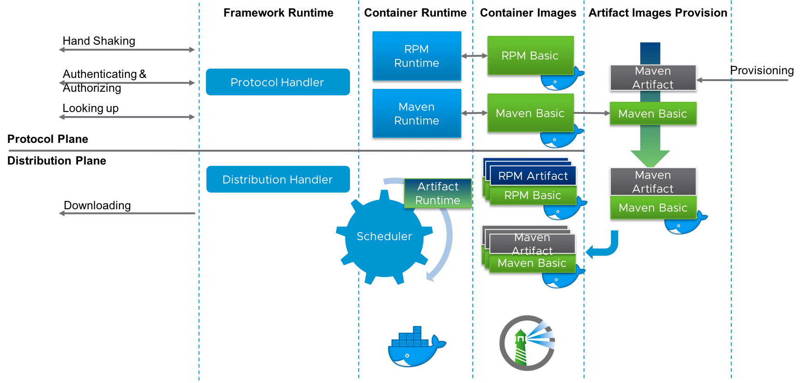
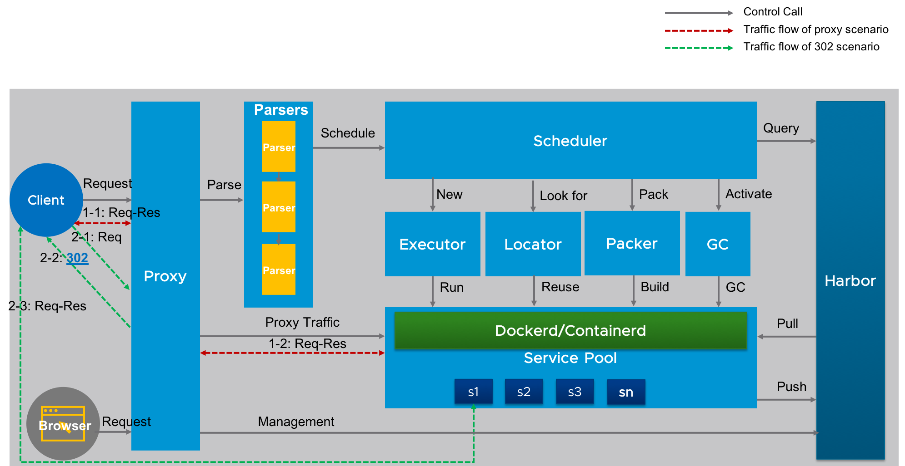
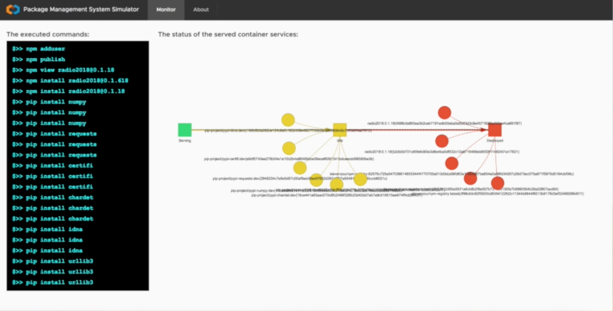

# chameleon


Project **chameleon** is incubated from and built on the popular open source project **[Harbor](https://github.com/vmware/harbor)**, which is an enterprise-class registry server that stores and distributes container images.

Project **chameleon** is designed to provide a general artifact registry to support different kinds of package management technologies like `npm`, `pip`, `rpm`, `gem` and `image` etc. by scheduling the serverless container services based on the container images for the corresponding software package. The container images for the corresponding software package will be managed and distributed via **[Harbor](https://github.com/vmware/harbor)** project.

**Limitations:** Currently, the project is only support subset of `pip` and `npm` commands.

**Project Status: Incubating**

## Contributors
**Originator:** [Steven Zou](https://github.com/steven-zou)

**Contributors**:
* [Steven Zou](https://github.com/steven-zou)
* [Daniel Jiang](https://github.com/reasonerjt)

## The overall workflow
The following graph is showing the overall workflow:


## The overall architecture
Here is the overall architecture design of this project:


## How to run

### Configurations

The configurations are defined in a yaml file, e.g:
```
#Configurations for registry factory
host: "" #Listen host
port: 7878 #Listen port
dockerd: #Docker runtime
  host: "10.160.160.148"
  port: 2375
  admin: "admin"
  password: "Harbor12345"
harbor: #Harbor
  host: "10.160.118.86"
  protocol: http
npm_registry: #npm
  namespace: "npm-registry"
  base_image: "stevenzou/npm-registry"
  base_image_tag: "latest"  
pip_registry: #pip
  namespace: "registry-factory"
  base_image: ""
  base_image_tag: ""
```

Update the configuration file before running:

|           options            |                      comments                              |                
|------------------------------|------------------------------------------------------------|
|  host                        | The server listening host                                  |
|  port                        | The server listening port                                  |
|  dockerd.host                | The remote docker daemon host                              |
|  dockerd.port                | The remote docker daemon port                              |
|  dockerd.admin               | admin account for 'docker login' to push images            |
|  dockerd.password            | admin password for 'docker login'                          |
|  harbor.host                 | hostname of harbor registry                                |
|  harbor.protocol             | 'http' or 'https' protocol                                 |
|  npm_registry.namespace      | the project name of Harbor used for npm package management |
|  npm_registry.base_image     | the base image used for wrapping npm package               |
|  npm_registry.base_image_tag | the tag of base image used for wrapping npm package        |
|  pip_registry.namespace      | the project name of Harbor used for pip                    |
|  pip_registry.base_image     | <NOT_USED>                                                 |
|  pip_registry.base_image_tag | <NOT_USED>                                                 |

### Start the server
Use the following command to start the server:

```
go run mian.go -c <config file>

#or 
#go build -o factory
#factory -c <config file>
```

### Run the commands
Once the server is started, it can be a npm repository or a pip repository.

The following `npm` commands are tested:
```
#adduser
npm adduser --registry http://<server address>

#login
npm login --registry http://<server address>

#publish npm package
#the folder 'package' under this repository is a sample npm package,
#it can be published
cd package/

#change the version
vi package.json

npm publish --registry http://<server address>

#view the published package
npm view <package-name>@<version> --registry http://<server address>

#install the npm package

#the folder 'install' is a sample folder for installing
cd install

npm install <package-name>@<version> --registry http://<server address>

#try the package
#a sample node file is located in 'install'
node index.js
#
```

`pip install` can be run if the related packages images are pushed to the configured harbor registry.
```
pip install -i http://<server address> --trusted-host <server address> <package name>
```

### Simulator:
There is a web page to simulate the working process of the system. It's a separate project which is linked as a submodule of this project. 

